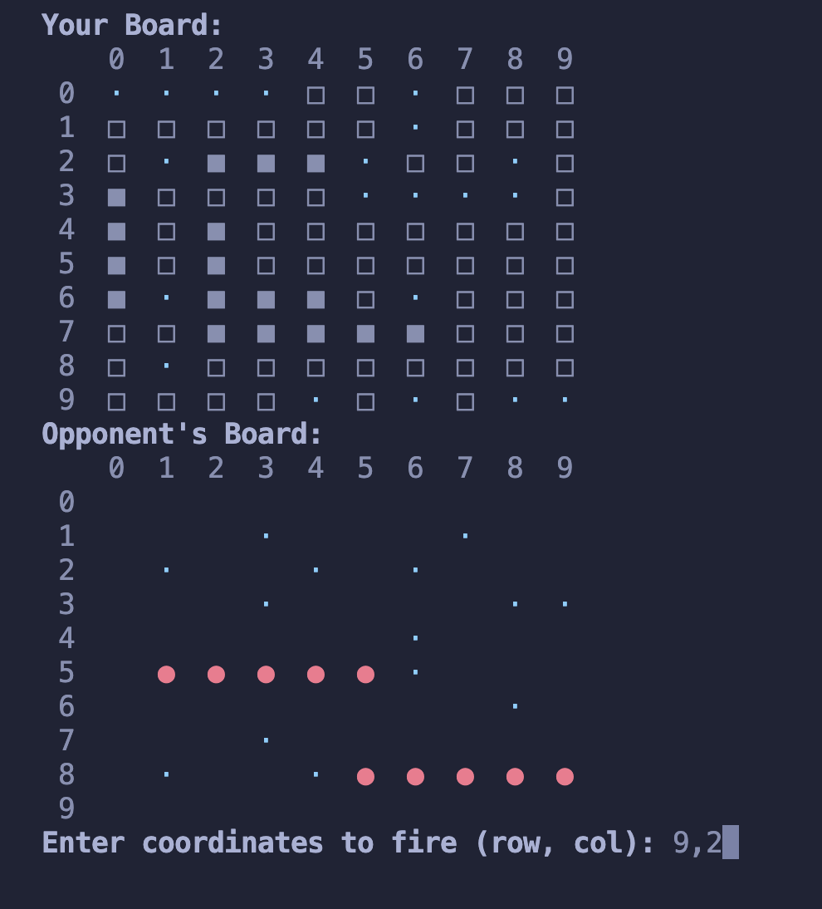

# rust-battleship

A mini and portable CLI Battleship game built with Rust, bringing one of my childhood favorite board games to life.

Enjoy a fun and nostalgic experience right from your terminal!

## App Preview


## Prerequisites
- Rust: Make sure Rust is installed. You can install it from [rust-lang.org](https://www.rust-lang.org/).
- Cargo: Rust’s package manager, which comes with the Rust installation.

## Getting Started
1- **Clone the Repository :**
```bash
git clone https://github.com/jaunewick/rust-battleship.git
cd rust-battleship
```

2- **Build the Application :**

Compile the Rust code:
```bash
cargo build
```

3- **Run the Game :**

Execute the compiled binary:
```bash
cargo run
```

4- **Play the Game :**

Follow the on-screen instructions to play Battleship in your terminal.

Enjoy! :)